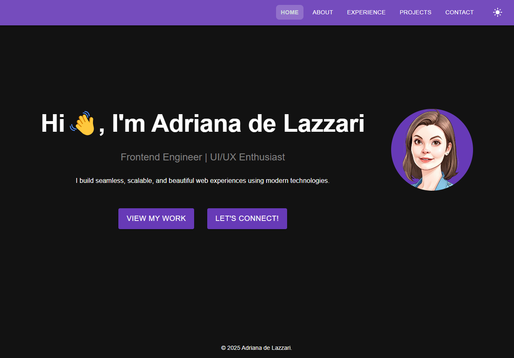
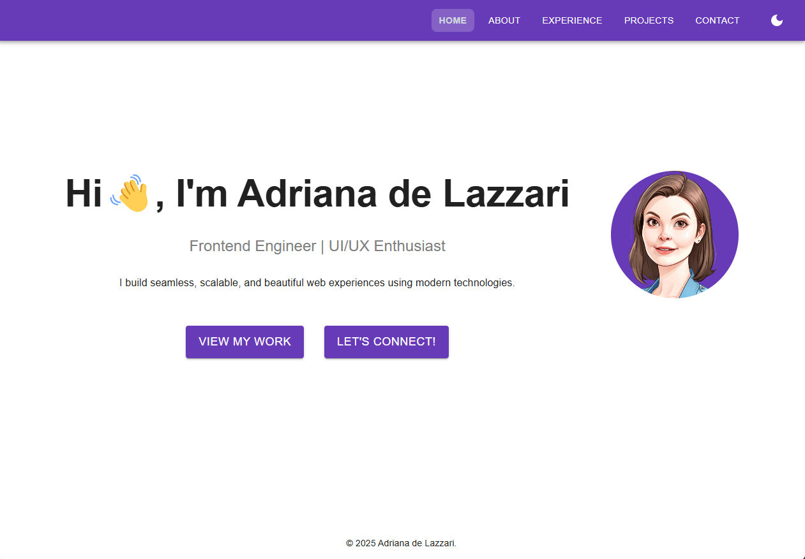
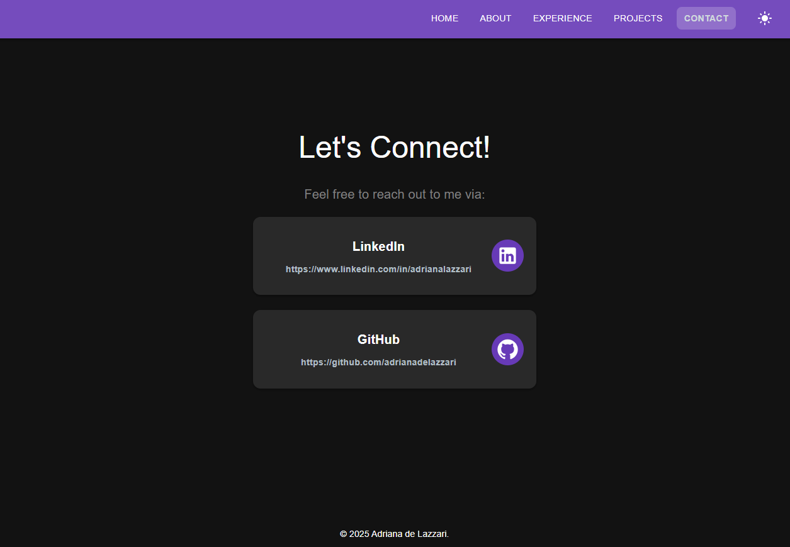
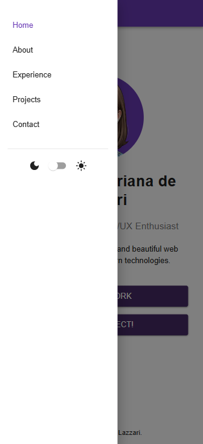

# 🌐 Adriana de Lazzari – Portfolio

A **modern and responsive developer portfolio** showcasing my projects, skills, and experience.  
Built with **React**, **Material UI**, and **Framer Motion**.

## 🚀 Features

✅ **Professional Portfolio UI** – Clean and elegant design  
✅ **Fully Responsive** – Works on all devices  
✅ **Dar/Light Modes** – Toggle between light & dark themes  
✅ **Projects Showcase** – Highlighted projects with links  
✅ **Contact Section** – Easy-to-access LinkedIn & GitHub

## 🎥 Live Demo

🔗 **View Portfolio**: [My Portfolio](https://adrianadelazzari.vercel.app/)

## 📸 Screenshots







## 🛠️ Tech Stack

- ⚛ **React** – Frontend framework
- 🎨 **Material UI** – Styling & Components
- 💡 **Framer Motion** – Smooth animations
- 🚀 **Vercel** – Deployment

## 🔧 Installation & Setup

To run the **Portfolio Project** locally:

### 1️⃣ Clone the Repository

```sh
git clone https://github.com/adrianadelazzari/portfolio.git
cd portfolio
```

### 2️⃣ Install Dependencies

```sh
npm install
```

### 3️⃣ Start the Development Server

```sh
npm start
```

Now, open http://localhost:3000/ in your browser.

### 📜 License

This project is open-source under the [MIT License](https://mit-license.org/).
